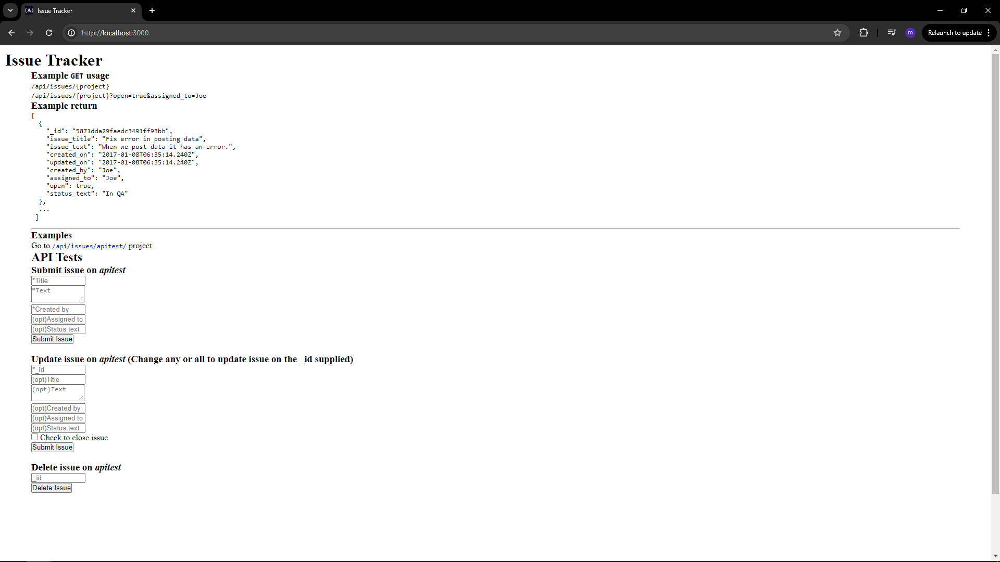

# Issue Tracker

This is a simple project that I did to get the [Quality Assurance course](https://www.freecodecamp.org/learn/quality-assurance) by FreeCodeCamp. The boilerplate can be found at [this link](https://github.com/freeCodeCamp/boilerplate-project-issuetracker/).

## Explanation about the project

These are the requirements that I have fulfilled to complete this project:

- Complete the necessary routes in /routes/api.js
- Create all of the functional tests in tests/2_functional-tests.js
- Copy the sample.env file to .env and set the variables appropriately
- To run the tests automatically, add NODE_ENV=test in your .env file
- To run the tests in the console, use the command npm run test

I have also written some tests in **tests/2_functional-tests.js**. These are the criteria:

- Create an issue with every field: POST request to /api/issues/{project}
- Create an issue with only required fields: POST request to /api/issues/{project}
- Create an issue with missing required fields: POST request to /api/issues/{project}
- View issues on a project: GET request to /api/issues/{project}
- View issues on a project with one filter: GET request to /api/issues/{project}
- View issues on a project with multiple filters: GET request to /api/issues/{project}
- Update one field on an issue: PUT request to /api/issues/{project}
- Update multiple fields on an issue: PUT request to /api/issues/{project}
- Update an issue with missing _id: PUT request to /api/issues/{project}
- Update an issue with no fields to update: PUT request to /api/issues/{project}
- Update an issue with an invalid _id: PUT request to /api/issues/{project}
- Delete an issue: DELETE request to /api/issues/{project}
- Delete an issue with an invalid _id: DELETE request to /api/issues/{project}
- Delete an issue with missing _id: DELETE request to /api/issues/{project}

The original page explaining the requirements could be found at [this](https://www.freecodecamp.org/learn/quality-assurance/quality-assurance-projects/issue-tracker) link.

## To run project

### Requirements

To run the project you need to have:

- Internet Connection
- Visual studio code installed
- Node installed

### Steps to run the project

- Git clone this project
- go to root project
- Write: npm install
- Write: npm run start

### To run tests

- run: npm run test

### To run the project automatically:

- add NODE_ENV=test in your .env file